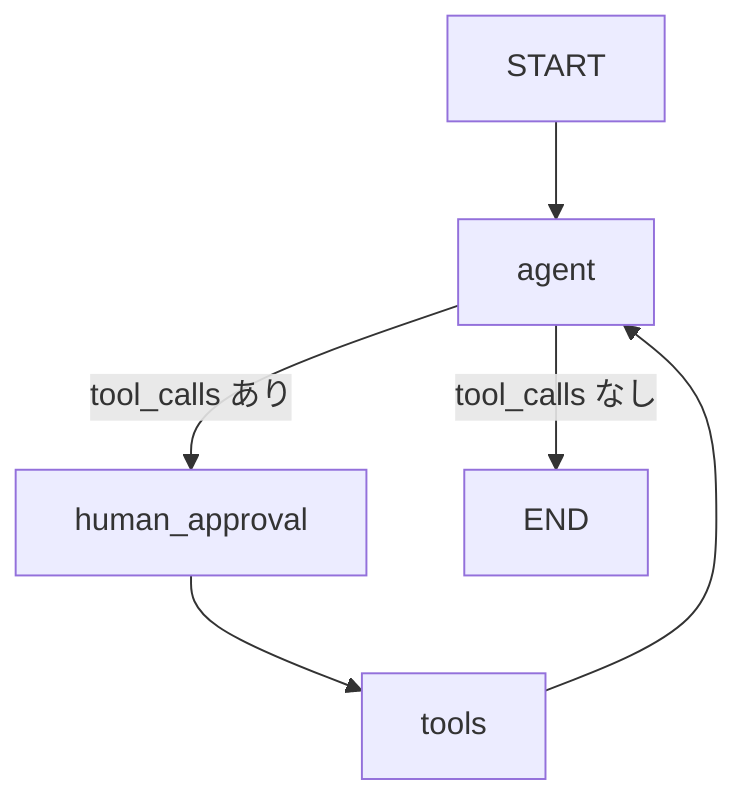

# LangGraph エージェント - Graph API版

LangGraphの**Graph API**を使用した実装です。従来のfunc API（`@entrypoint`、`@task`）とは異なり、より明示的なグラフ構造でエージェントを実装しています。

## func API版との違い

### func API版 (`agents.py`)
```python
@entrypoint(checkpointer)
def agent(messages):
    # 自動的にグラフノードとして扱われる
    llm_response = invoke_llm(messages).result()
    # ループロジックを直接記述
    while True:
        if not llm_response.tool_calls:
            break
        # ...
```

**特徴:**
- ✅ Pythonの関数として自然に記述
- ✅ 制御フローが直感的
- ✅ コードが少なくて済む
- ❌ グラフ構造が暗黙的
- ❌ 複雑なルーティングには不向き

### Graph API版 (`agents_graph.py`)
```python
workflow = StateGraph(AgentState)
workflow.add_node("agent", agent_node)
workflow.add_node("human_approval", human_approval_node)
workflow.add_node("tools", tool_execution_node)
workflow.add_conditional_edges("agent", should_continue, {...})
agent_graph = workflow.compile(checkpointer=checkpointer)
```

**特徴:**
- ✅ グラフ構造が明示的
- ✅ ノード間の依存関係が明確
- ✅ 複雑なルーティングロジックに対応
- ✅ グラフの可視化が容易
- ❌ コード量が多くなる
- ❌ 学習コストが高い

## ファイル構成

```
langchain-test/
├── agents.py              # func API版（@entrypoint、@task使用）
├── agents_graph.py        # Graph API版（StateGraph使用）
├── streamlit_app.py       # func API版のUI
├── streamlit_app_graph.py # Graph API版のUI
└── README_GRAPH.md        # このファイル
```

## グラフの構造



### ノードの説明

1. **agent**: LLMを呼び出してツール呼び出しを決定
2. **human_approval**: ツール実行前に人間の承認を取得（interrupt使用）
3. **tools**: 承認されたツールを実行

### エッジの説明

- **agent → human_approval**: ツール呼び出しがある場合
- **agent → END**: ツール呼び出しがない場合（最終回答）
- **human_approval → tools**: 承認後のツール実行
- **tools → agent**: ツール実行結果をLLMに返す

## 使用方法

### Graph API版の起動

```bash
# Streamlit UIで起動
make run-streamlit-graph

# または直接実行
uv run streamlit run streamlit_app_graph.py
```

### 開発モード（ホットリロード）

```bash
make dev-graph
```

## Graph API版の実装詳細

### 1. State の定義

```python
class AgentState(MessagesState):
    approved_tools: list  # 承認されたツールのリスト
```

`MessagesState`を継承し、`approved_tools`フィールドを追加しています。

### 2. ノード関数

各ノードは`state`を受け取り、更新する辞書を返します：

```python
def agent_node(state: MessagesState) -> dict:
    """LLMを呼び出してツール呼び出しを決定"""
    response = llm_with_tools.invoke(...)
    return {"messages": [response]}
```

### 3. ルーティング関数

条件分岐を実装：

```python
def should_continue(state: MessagesState) -> Literal["human_approval", "end"]:
    last_message = state["messages"][-1]
    if isinstance(last_message, AIMessage) and last_message.tool_calls:
        return "human_approval"
    return "end"
```

### 4. interrupt の使用

Graph API版でも`interrupt()`は同様に動作します：

```python
def human_approval_node(state: MessagesState) -> dict:
    for tool_call in last_message.tool_calls:
        feedback = interrupt(tool_data)  # グラフを一時停止
        if feedback == "APPROVE":
            approved_tools.append(tool_call)
    return {"approved_tools": approved_tools}
```

## Streamlit UIの違い

### func API版 (`streamlit_app.py`)
```python
# 直接agent関数を呼び出し
for chunk in agent.stream(input_data, stream_mode="updates", config=config):
    # ...
```

### Graph API版 (`streamlit_app_graph.py`)
```python
# コンパイル済みグラフを使用
for event in agent_graph.stream(input_data, config=config, stream_mode="updates"):
    # ...
```

主な違いは、Graph API版では`agent_graph.stream()`を使用する点です。イベントの構造も若干異なります。

## どちらを使うべきか？

### func API版を選ぶべき場合
- シンプルなエージェントを実装したい
- 制御フローが直線的
- 学習コストを抑えたい
- プロトタイプを素早く作りたい

### Graph API版を選ぶべき場合
- 複雑なマルチエージェントシステム
- 条件分岐やループが多い
- グラフ構造を可視化したい
- チームでの開発で構造を明確にしたい
- 既存のGraph APIの知識がある

## グラフの可視化

Graph API版では、グラフを画像として出力できます：

```python
from IPython.display import Image

# グラフを可視化
Image(agent_graph.get_graph().draw_mermaid_png())
```

## まとめ

| 項目 | func API | Graph API |
|------|----------|-----------|
| コード量 | 少ない | 多い |
| 学習コスト | 低い | 高い |
| 可読性 | 高い（シンプルな場合） | 高い（複雑な場合） |
| 拡張性 | 中 | 高 |
| デバッグ | やや難 | 容易 |
| 可視化 | 不可 | 可能 |

**推奨**: まずはfunc API版で始めて、複雑になってきたらGraph API版に移行するのが良いでしょう。
